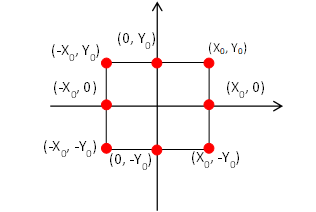
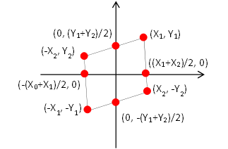

# CSS Matrix
@ 2019-04-15

---

CSS3的trasform: matrix(a, b, c, d, e, f)网上介绍有很多，但其实都是在讲怎么用它来替代rotate，skew等，没有提到matrix的精髓———矩阵变化，下文是我本人的一点小理解，稍微看看，或许对你有点帮助吧。

## 前情提要
1. 知道啥是矩阵
2. 会解多元方程组，O了

## 计算的样例
**原始图形**
这里以一个矩形作为示例，设定我们变形的中心是以矩形的中心作为原点，矩形宽2X<sub>0</sub>，高2Y<sub>0</sub>：
```css
{
  width: 2X0;
  height: 2Y0;
  transform-origin: center;
}
```
那么我们以当前矩形作为坐标系的原点，可以绘制一个矩形，四个角的坐标分别为：
右上角：(X<sub>0</sub>, Y<sub>0</sub>)
右下角：(X<sub>0</sub>, -Y<sub>0</sub>)
左下角：(-X<sub>0</sub>, -Y<sub>0</sub>)
左上角：(-X<sub>0</sub>, Y<sub>0</sub>)
和X，Y轴的交点分别为：
(0, Y<sub>0</sub>)，(-X<sub>0</sub>, 0)，(0, -Y<sub>0</sub>)，(X<sub>0</sub>, 0)



**变换后的图形**
理论上，新的图形只要跟原始的图形的表达式，彼此间是线性相关的，那么一定是可以透过一个固定数值的矩阵来进行线性变换的。因此，变换后的图形，一定是平行四边形，我们假设新的图形的四个角的坐标为（X<sub>1</sub>, Y<sub>1</sub>, X<sub>2</sub>, Y<sub>2</sub>均为正数，变换后的中心仍为原点)：
右上角：(X<sub>1</sub>, Y<sub>1</sub>)
右下角：(X<sub>2</sub>, -Y<sub>2</sub>)
左下角：(-X<sub>1</sub>, -Y<sub>1</sub>)
左上角：(-X<sub>2</sub>, Y<sub>2</sub>)
和X，Y轴的交点分别为：
(0, (Y<sub>1</sub> + Y<sub>2</sub>)/2)，(-(X<sub>1</sub> + X<sub>2</sub>)/2, 0)，(0, -(Y<sub>1</sub> + Y<sub>2</sub>)/2)，((X<sub>1</sub> + X<sub>2</sub>)/2, 0)


---
根据matrix(a, b, c, d, e, f)的转换规则：
x' = a*x + c*y + e
y' = b*x + d*y + f
在假设变换的时候，每个角所在的象限没有发生变化的前提下（即(X<sub>0</sub>, Y<sub>0</sub>)变为(X<sub>1</sub>, Y<sub>1</sub>)，(X<sub>0</sub>, -Y<sub>0</sub>)变为(X<sub>2</sub>, -Y<sub>2</sub>)，依次类推...）
我们可以得到上述坐标转换的一个方程组：
```
// 右上角
X1 = a*X0 + c*Y0 + e
Y1 = b*X0 + d*Y0 + f

// 右下角
X2 = a*X0 - c*Y0 + e
-Y2 = b*X0 - d*Y0 + f

// 左下角
-X1 = -a*X0 - c*Y0 + e
-Y1 = -b*X0 - d*Y0 + f

// 左上角
-X2 = -a*X0 + c*Y0 + e
Y2 = -b*X0 + d*Y0 + f
```
可以解得：
a = (X<sub>1</sub> + X<sub>2</sub>) / 2X<sub>0</sub>
b = (Y<sub>1</sub> - Y<sub>2</sub>) / 2X<sub>0</sub>
c = (X<sub>1</sub> - X<sub>2</sub>) / 2Y<sub>0</sub>
d = (Y<sub>1</sub> + Y<sub>2</sub>) / 2Y<sub>0</sub>
e = 0
f = 0

拿原图和X、Y轴的几个交点来演算，可以发现计算没有问题
(0, Y<sub>0</sub>)变换到((X<sub>1</sub> - X<sub>2</sub>) / 2, (Y<sub>1</sub> + Y<sub>2</sub>) / 2)
(-X<sub>0</sub>, 0)变换到((-X<sub>1</sub> - X<sub>2</sub>) / 2, (-Y<sub>1</sub> + Y<sub>2</sub>) / 2)
(0, -Y<sub>0</sub>)变换到((-X<sub>1</sub> + X<sub>2</sub>) / 2, (-Y<sub>1</sub> - Y<sub>2</sub>) / 2)
(X<sub>0</sub>, 0)变换到((X<sub>1</sub> + X<sub>2</sub>) / 2, (Y<sub>1</sub> - Y<sub>2</sub>) / 2)

如果变换后的图形，中心不再是坐标轴原点，那么中心的偏移量（向量以(X<sub>3</sub>, Y<sub>3</sub>)表示），那么可得
e = X<sub>3</sub>
f = Y<sub>3</sub>
