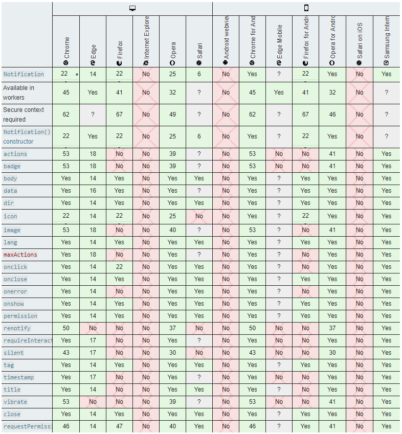
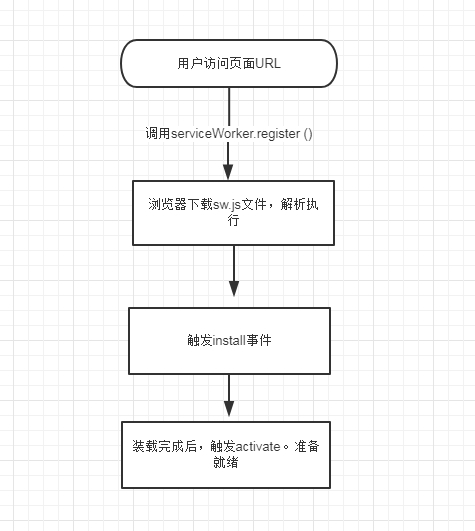

# PWA
@ 2019-06-25

---

PWA，Progressive web app，渐进式的web APP，一般情况下，我们使用它主要是因为其具有以下几点优势：
1. 推送功能（这个在移动端都支持的不咋地）
2. 可以通过配置manifest文件，以及header头部，使得其可以添加至用户主屏幕，获得类似原生APP的用户体验（安卓上不是特别理想）
3. 混合SSR（Sever-side Rending）以及CSR（Client-side Rending），再配合service worker，提高用户访问的相应速度

我们依次来讲一讲这几个特点：

---

## 推送 ##
这个功能运用的是新特性Notification API，目前各大浏览器对其适配的程度如下：


数据来源：[MDN](https://developer.mozilla.org/en-US/docs/Web/API/Notification#Browser_compatibility)

移动端支持的不咋地，只有安卓上的Chrome/Opera以及三星自带的浏览器支持的比较多，所以这个功能，不用也罢。

一般情况下，我们使用推送的套路比较简单，使用的API如下：

<b>1. 询问询问是否允许发送请求</b>
```javascript
Notification.requestPermission()
  .then(function(result) {
    console.log(result)
    // result的值可能为'granted'或者'denied'，代表准了和不行
  })

```

<b>2. 发送请求</b>
```javascript
let notif = new Notification('通知的标题', {
  body: '通知的内容',
  icon: '通知的icon'
})

notif.onclick = function() { console.log('onclick') } // 用户点击推送的回调
notif.onclose = function() { console.log('onclose') } // 用户点击关闭的回调
notif.onshow = function() { console.log('onshow') } // 推送发出并显示的回调
```

---

## 添加至主屏 ##
其实所有的H5的页面本身都可以添加至手机的屏幕上，只是添加上来的图标，都是页面的截图，点开的页面，又重新在浏览器中打开，简直就是个书签，所以解决方案是：

通过在HTML文件的头部，配置link来指定manifest文件

```html
<link rel="manifest" href="manifest.json">
```

文件内容一般需要包含以下内容：
```json
{
  "name": "航班管家Lite", // APP的名称
  "short_name": "航班管家Lite", // 添加到主屏时的简称
  "description": "航班管家Lite", // 对该APP的描述
  "icons": [ // 添加到主屏幕时的icon
    {
      "src": "/dev/liuzihao/hangban/test.png",
      "sizes": "192x192",
      "type": "image/png"
    },
    {
      "src": "/dev/liuzihao/hangban/test.png",
      "sizes": "512x512",
      "type": "image/png"
    }
  ],
  "start_url": "/dev/liuzihao/hangban/index.html?standalone=1", // 添加到主屏幕后，点击打开时显示的默认页面
  "scope": "/dev/liuzihao/hangban/", // 该APP启动时，URL允许跳转的范围
  "display": "standalone", // APP显示的模式，可以配置standalone/fullscreen，这俩差不多，但是standalone模式下会显示部分系统级别的UI，譬如载入进度条
  "orientation": "portrait", // 默认显示方向
  "background_color": "#F3F3F3", // 桌面图标的背景色
  "theme_color": "#F3F3F3" // web应用启动后，背景色
}
```

由于ios上的Safari对于这manifest文件的适配程度有限，所以还需要在文件头部加上额外的信息，使得能够正确的显示APP图标：
```html
<!-- WEB是否以全拼方式来运行，yes即不显示工具栏和菜单栏 -->
<meta name="apple-mobile-web-app-capable" content="yes">
<!-- 显示的标题烂的颜色，默认default，还可以配置成black -->
<meta name="apple-mobile-web-app-status-bar-style" content="default">
<!-- 在iPhone，iPad，iTouch的Safari添加到主屏幕时所显示icon -->
<link rel="apple-touch-icon" href="icon.png">
```

## Service Worker ##
这么理解，Service Worker（后续简称SW）就是一个嵌入在浏览器和服务器之间的代理，主要在成功注册了SW了之后，SW会将待缓存的文件安装到Cache中（即安装文件），待后续遇到浏览器发起的fetch请求，则就会从Cache中去读取文件，返回给浏览器。SW保留缓存文件最多24小时，超时则会重新更新文件。

一个典型的SW的声明周期如下所示：


对于SW的注册，我们使用函数navigator.serviceWorker.register()，会返回一个Promise对象，then内置入的匿名函数，会传入一个注册的实例：
```javascript
if('serviceWorker' in navigator) {
  navigator.serviceWorker.register('SW脚本的URL', { scope: 'SW注册范围的URL' })
  .then(function(registration) {
    // registration实例，支持update方法来动态更新SW
    setInterval(function() {
      registration.update()
    }, duration) // 定时去更新SW，以保证页面能够获取新的缓存资源
  }).catch(function(error) {
    // error
  })
}
```
函数需要传入两个参数，一个是注册成功后，SW实际运行得脚本，另一个是options字段，目前只支持一个scope字段，表明SW的生效范围，超过范围的请求，都不会被SW所处理，例如：
```javascript
navigator.serviceWorker.register('./sw.js', { scope: '/hangban/vue/lzh/' })
```

SW脚本文件，主要是负责注册和处理请求：
```javascript
// 由于install/activate的操作，一般是针对caches的一部操作，因此
// service worker标准提供一个waitUtil方法，接受Promise，待resolve之前，
// 都会阻塞住
// caches是CacheStorage实例的只读全局变量，跟其他类似localStorage、indexedDB存储方案相比较，
// Cache是异步化的存储方式，并且是以Request为key，Response为value来进行存储的，不同的
// URL，可以根据不同header存储不同的Response，并且与HTTP的缓存彼此之间完全隔离开了，
// 完全就是用来搭配SW来一并使用的。

// caches.open()就打开/创建了一个以指定标识符来区分的Cache实例
// Cache实例有几个重要的方法：
// 1. put，cache.put(request, response)，添加相应的Request以及对应的Response
// 2. delete，cache.delete(request)，删除Request
// 3. add，cache.add(request)，添加指定的Request，而后cache会自动请求并获取Response
// 4. addAll，cache.addAll([])，添加指定的Request数组，只有所有的请求都成功的返回了，才会将各自的Response写入
// 5. match，cache.match(request)，返回第一个匹配的Response
// 6. keys，cacge.keys()，返回所有的Request实例列表
self.addEventListener('install', e => {
  e.waitUntil(
    caches.open('cache的标识符')
      .then(cache => cache.addAll(['待加入的请求列表']))
      .then(() => self.skipWaiting())
      // self.skipWaiting()是为了新SW安装成功后立即激活
      // 因为SW被更新后，既有得旧SW还存在，新下载SW会处于waiting状态
      // 这时候使用skipWaiting就会直接让新的SW激活
  )
})

// 触发更新的几种条件：
// 1. 路由首次跳转到指定的作用域范围内
// 2. 24小时内没有更新检测
// 3. SW重新进行注册的时候
self.addEventListener('activate', e => {
  e.waitUntil(
    // 或许需要做点事，然后返回一个Promise
  )
})

// 当监听到网络请求事件的时候，SW会读取请求的Request，在caches中去查找，
// 如果有缓存了对应的Response，则直接返回对应的Response，否则使用fetch
// 再重新读取对应的请求内容
self.addEventListener('fetch', e => {
  e.respondWith(
    caches.match(e.request).then(response => {
      if(!response){
        return response
      }
      return fetch(e.request.url)
    })
  )
})
```

---

其实完成了上述得实现，并不能保证一定是个PWA，根据MDN上的[定义](https://developer.mozilla.org/zh-CN/docs/Web/Progressive_web_apps/Introduction#%E4%BB%80%E4%B9%88%E4%BD%BF%E5%BA%94%E7%94%A8%E6%88%90%E4%B8%BAPWA)，一个PWA需要包含有一下特性：
* [Discoverable](https://developer.mozilla.org/en-US/Apps/Progressive/Advantages#Discoverable), 内容可以通过搜索引擎发现。
* [Installable](https://developer.mozilla.org/en-US/Apps/Progressive/Advantages#Installable), 可以出现在设备的主屏幕。
* [Linkable](https://developer.mozilla.org/Apps/Progressive/Advantages#Linkable), 你可以简单地通过一个URL来分享它。 
* [Network independent](https://developer.mozilla.org/en-US/Apps/Progressive/Advantages#Network_independent), 它可以在离线状态或者是在网速很差的情况下运行。
* [Progressive](https://developer.mozilla.org/en-US/Apps/Progressive/Advantages#Progressive), 它在老版本的浏览器仍旧可以使用，在新版本的浏览器上可以使用全部功能。
* [Re-engageable](https://developer.mozilla.org/en-US/Apps/Progressive/Advantages#Re-engageable), 无论何时有新的内容它都可以发送通知。
* [Responsive](https://developer.mozilla.org/en-US/Apps/Progressive/Advantages#Responsive), 它在任何具有屏幕和浏览器的设备上可以正常使用——包括手机，平板电脑，笔记本，电视，冰箱，等。
* [Safe](https://developer.mozilla.org/en-US/Apps/Progressive/Advantages#Safe), 在你和应用之间的连接是安全的，可以阻止第三方访问你的敏感数据。

需要保证是一个自适应的网页，并且可以通过HTTPs来访问，有正确的配置manifest文件，兼容service worker，支持notification等一系列措施，才能是一个合格的PWA应用。
